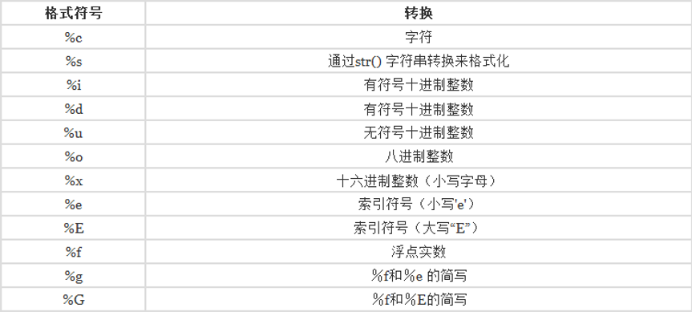

# 前言
## 1. 解释器安装完成之后如何验证是否安装成功
1. 点击 开始菜单 在里面找到 "搜索" 菜单，点击 输入 cmd【命令提示符】 找到并打开
2. 按住window+R快捷键 可以快速的打开 运行窗口，并在里面输入python, 即可看到安装结果

## 2. 如何退出python的交互式环境：
在环境里面输入 exit() 或者quit() 回车退出

## 3. 执行 python 文件
声明一个.py文件 可以保存我们的python代码，那么如何执行这个python文件呢
1. 过程:首先打开命令行的提示符，进入到要执行文件的本地目录，然后在
2. 直接输入  python 文件的名字.py 【熟练一些基本的dos操作命令】
3. 捷径：在打开执行文件的资源管理上面的路径输入框 敲入 cmd 命令即可

## 4. pycharm优点:  
节省时间和精力，目的就是让开发者更加的快捷方便，通过提供的工具和各种性能来帮助开发者组织资源，减少失误，提供捷径
建立统一标准、管理开发工作

## 5. 变量的学习：
1. 什么是变量呢
变量其实就是个盒子，里面可以装各种东西，装了苹果，箱子和其他的东西结合的时候 就是属于苹果 ，装了香蕉 箱子和其他的东西结合的时候 就是属于香蕉
在python当中 其实变量的概念和初中代数的方程变量是一只
方程式 y=x*3  x就是变量 当x=2 结果就是6 x=10 结果就是30


## 6. 历史
起源
1. 1989年由Guido van Rossum 开发作为ABC语言的继承
1. 1991年发布第一个版本
1. Guido 是Monty Python的喜剧团体的爱好者所以命名为 Python

历程
1. 2011年1月TIOBE编程语言排行榜评为2010年度语言
1. 2014年后Python的使用率一直程线性增长
1. 2017年IEEE研究报告显示Python是最受欢迎语言

发展
1. 2000年发布Python2.0版本，增加垃圾回收，支持Unicode
1. 2008年发布Python3.0版本此版不完全兼容之前的Python源代码
1. 2020年官方将不再支持Python2.0版本

# 一、打印 helloworld
print() 输出函数 直接打印
input() 输入函数，从控制台获取信息；如果需要整形，需要强转

# 二、python注释
## 1. 单行注释
单行注释用#号，#号右边的就是注释的内容，python解析器遇到#号就会当做注释，不会去解析#号后面的内容。

## 2. 多行注释
多行注释使用三个单引号'''内容''' 也可以使用三个双引号"""内容"""  
注意：多行注释开头三个引号需要新起一行，不能跟在代码后面

## 3. 特殊的注释
Python中有两句特殊的注释，在py文件首行 #!/usr/bin/python3 ; # -- coding=utf-8 --   
这两句注释分别指的是指定python解析器的路径，指定编码格式，只能写在py文件最前面。
这两句注释 一般在 Linux 开发时写， win下开发则不用。

指定编码格式，一般用于Python2版本，由于Python2版本解析器默认Python默认采取的ASCII编码，不支持中文。  
为了能在Python2版本的代码上写中文，一般在指定解析器后指定编码方式为utf-8。  
Python3采用utf-8的 编码方式支持中文，如果需要兼容Python2版本，一般都加上指定编码格式这一行代码。  


# 三、数据类型
python的基本数据类型

1. 数字 num :包括五个
    a、 int(有符号整数)
    b、 long（长整形）（python 3 取消，都用int 代替）
    c、 float(浮点型)
    d、 complex(复数)
    e、 布尔值（bool）： True False
2. 字符串 str
3. 列表 list
4. 元组 tuple
5. 字典 dict

每个类型都对应 一个各自方法。  
如 int(), str(), float(), complex(), bool(), str(), list(), tuple(), dict()  
在java中属于构造函数，python 中，可以进行强转作用。以后会用到。

# 四、变量
* 变量的命名规则  
1. 变量必须以字母（a - z，A - Z）或下划线（_）开头
2. 其他字符可以是`字母，数字或 _`
3. 变量区分大小写
4. Python 关键字不能用作变量名。

* 命名规范
1. 见名知意，尽量使用有语义的单词命名。如使用 password 用作密码，username 用户名。
2. `小驼峰式命名法`：第一个单词首字母小写其他单词首字母大写，如 userName
3. `大驼峰式命名法`：全部单词首字母都用大写 ， 如 UserName
4. `下划线命名法`：每个单词用_下划线连接 ， 如 user_name

# 五、运算符

## 1. 算数运算符
算数运算符包括 + - * / % **(求指数) //（求商）
```python
a = 7
b = 3

print('a+b=', a + b) # 10
print('a-b=', a - b) # 4
print('a*b=', a * b) # 21
print('a/b=', a / b) # 2.3    # 这里不同与java；java 会取整 得到 2
print('a%b=', a % b) # 1
print('a**b=', a ** b)  # 7*7*7
print('a//b', a // b)  # 取整数 类似于 java 的 / (除)
```

## 2. 比较运算符
比较运算符包括 == != > < >= <=  6个比较运算符
```python
a, b = 10, 5

print('a == b:', a == b) # False
print('a != b:', a != b) # True
print('a > b:', a > b)   # True
print('a < b:', a < b)   # False
print('a >= b:', a >= b) # True
print('a <= b:', a <= b) # False
```

## 3. 逻辑运算符
逻辑运算符 and or  not 共 3 个
1. and 逻辑运算符 条件比较严格,全true 才为 true， 有一个为False 则为False
2. or 逻辑运算符 全 false 才为 false, 有一个为True 则为True
3. not 逻辑运算符 True 为False，False 为 True

优先级问题：（） > not > and > or

## 4. 赋值运算符
赋值运算：  算数运算的补充 += -= *= /= %= **= //=  共7个
1. a += b 等价于 a = a + b
2. a -= b 等价于 a = a - b
3. a *= b 等价于 a = a * b
4. a /= b 等价于 a = a / b  这里的除不会取整数，
5. a %= b 等价于 a = a % b  取余数
6. a **= b 等价于 a = a ** b
7. a //= b 等价于 a = a // b 取整数 ，类似于 java 的 /（除法）


# 六、输入与输出


## 1. 输出方式一 ：占位符方式
python 有一个简单的字符串格式化方法，使用%做占位符。%后面跟的是变量的类型。

% : 占位符  
\n: 换行效果  
%s: 代表 字符串（）str  
%d: 代表 整形

```python
me = '我的'
classPro = '清华附中一年级3班'
age = 7
print('%s 名字是小明：来自【 %s 】, 今年 %d 岁了' % (me, classPro, age))
```

## 2. 常用的格式化符号
可以去百度搜索



## 3. 输出不换行
end 关键字：
end 是 print() 函数中的关键字。
print() 函数 每次输出都是换行的。加入end参数，使用end=“”中的内容代替换行，分隔每次循环输出内容
如： print(' 这是字符串 ', end=' ')， 用 end 里面的空字符串 来代替 换行


## 4. 输出方式二：.format()
```python
me = '我的'
classPro = '清华附中一年级3班'
age = 7
print('{} 名字是小明：来自【 {} 】, 今年 {} 岁了'.format(me, classPro, age))
```

## 5. 输入方式 input()
从控制台获取数据

1. 获取字符串
```python
nameInput = input("请输入您的姓名:")
print(type(nameInput)) # 查看输入的类型
```

1. 获取整形
```python
ageInput = int(input("请输入您的年龄:"))
print(type(ageInput)) # 查看输入的类型
```

`input() 函数 中的字符串可以不写，为提示语句。`


