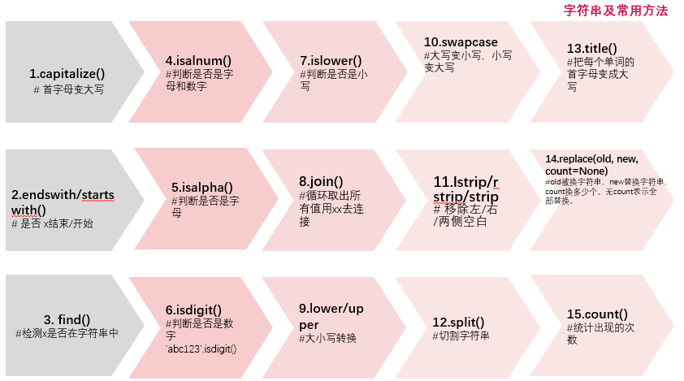
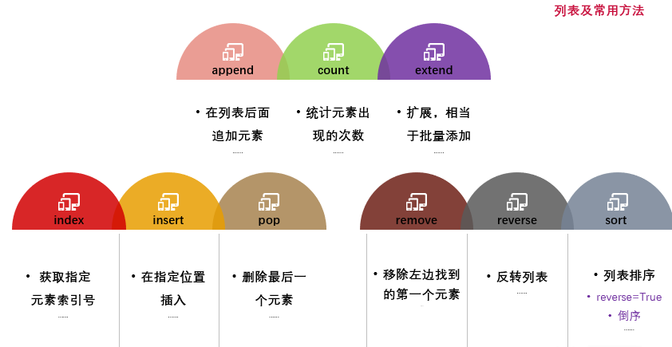
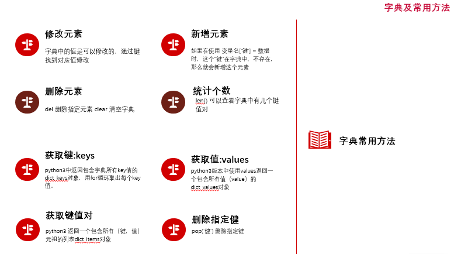
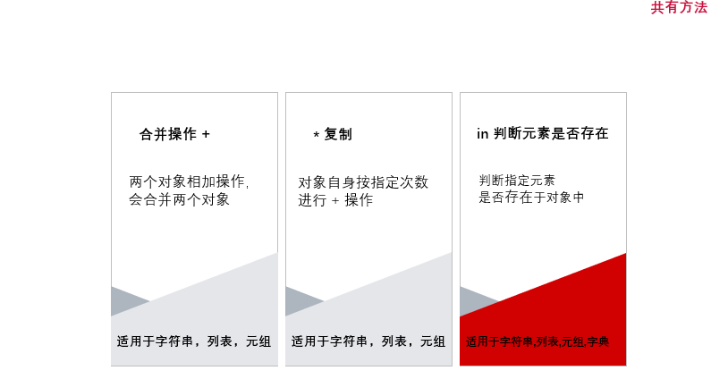

# 前言 
这一节 学习 5个数据类型的 各种常用操作

python  的数据类型  
1. 数字  
    int 整形  
    long 长整形（python3 取消）  
    float 浮点型  
    complex 复数  
    bool 布尔值  
2. str 字符串
3. list 列表
4. tuple 元组
5. dict 字典

注意：  
每个类型都对应 一个各自方法。  
如 int(), str(), float(), complex(), bool(), str(), list(), tuple(), dict()  
在java中属于构造函数，python 中，可以进行强转作用。以后会用到。

# 一、字符串 str 操作
字符串中有下标，从 0 开始

1. str.capitalize()  首字母转换大写
2. str.strip()       去掉两边的空格
3. str.lstrip()      去掉左边的空格
4. str.rstrip()      去掉右边的空格
5. id(对象)             查看内存地址
6. str.find('')       查找子字符串是否存在，返回的是该字符串在整体字符串的第一个下标,找不到返回 -1
7. str.index('')      检测字符串中是否包含子字符串，返回的是下标值，找不到返回报错
8. str.startswith('')、str.endswith('') 判断字符串是否以某个字符串为开头或者结尾
9. str.lower()、字符串.upper() 将字符串转化为小写或者大写
10. 切片方法 slice [start: end:step]  左闭右开， start<=value<end 范围  截取字符串方法
切片是指截取字符串中的其中一段内容。 切片使用语法：[起始下标：结束下标：步长] 切片截取的内容不包含结束下标对应的数据，步长指的是隔几个下标获取一个字符。

切片操作，比较重要  

# 二、列表 list 操作
列表中有下标，从 0 开始  
创建一个列表，只要把逗号分隔的不同的数据项使用方括号括起来即可。  
list是一种有序的集合，可以随时添加和删除其中的元素。 

列表的下标取值/切片/是否越界与字符串一致，区别就是列表是获取元素。  
用for循环可将列表中的元素一个一个取出，取完后退出循环。

1. type(object) 查看类型，适用于所有数据类型
2. len(object)  函数可以获取到列表对象中的数据个数，适用于所有数据类型
3. [start: end:step] 通过下标和切片取值
4. list.append(['fff', 'ddd']) 追加操作， 插入的是一个,追加到最后
5. list.insert(1, '这是我刚插入的数据')  插入操作 需要执行一个位置插入
6. list(range(10))  强制转换为list对象
7. list.extend(list(range(10)))  拓展  等于批量添加
8. list[0] = 333.6  列表 修改
9. del listC[0]  # 删除列表中第一个元素  
del list[1:3]  # 批量删除多项数据 slice  
list.remove(20)  # 移除指定的元素  参数是具体的数据值  
list.pop(1)  # 移除制定的项  参数是索引值
10. list.index(11)   返回的是一个索引下标
11. list.index(25, 5, 16)  查找 25 ，从下标为5开始查找 步长为16的范围 。返回的是一个索引下标,
12. list.count(22)  统计元素出现的次数

# 三、元组 tuple 操作
特点：
1. 元组与列表类似，不同之处在于元组的元素不能修改。元组使用小括号，元组也是通过下标进行访问
2. 元组创建很简单，只需要在括号中添加元素，并使用逗号隔开即可。  
3. 元组的内置方法count，统计元素在元组中出现的次数  
4. 元组的内置方法index 查找指定元素在元组中的下标索引  

1. for循环 进行 元组 遍历 
2. 切片操作  
tuple[::-1]  # 步长为-1时，逆序打印  
tuple[::-2]  # 表示反转字符串 每隔1 个取一次  
tuple[::-3]  # 表示反转字符串 每隔 2 个取一次  
tuple[-2:-1:]  # 倒着取下标 为-2 到 -1 区间的  左不包含，右包含  
tuple[-4:-2:]  # 倒着取下标 为-2 到 -1 区间的  
3. 元组不可修改，但可修改里面的列表
print(type(tuple[4]))  # <class 'list'>  
tuple[4][0] = 285202  # 可以对元组中的列表类型的数据进行修改  
4. 元组和 range()
tuple = tuple(range(10))
5. tuple.count(4))  # 可以统计元素出现的次数

# 四、字典 dict 操作
字典是Python的中重要的一种数据类型，可以存储任意对像。  
字典是以键值对的形式创建的{'key':'value'}利用大括号包裹着。  
字典中找某个元素时，是根据键、值字典的每个元素由2部分组成，键:值  
访问值的安全方式get方法，在我们不确定字典中是否存在某个键而又想获取其值时，可以使用get方法，还可以设置默认值  
注意点：  
1. 字典的键（key）不能重复，值（value）可以重复。  
2. 字典的键（key）只能是不可变类型，如数字，字符串，元组。  

1. 遍历
直接打印  
for循环遍历
2. update() 可以更新和添加，两种方式
3. dictA.keys()   # 获取所有的 键
4. dictA.values() # 获取所有的 值
5. dictA.items()  # 获取所有的 键和值 # 每个 为 元组
6. 字典 删除: del 关键字 和 pop() 方法  
del dictA['name']  
dictA.pop('age')  
7. print('按照 key 排序', sorted(dictA.items(), key=lambda item: item[0])) # 如何排序， 按照 key 排序

# 五、字典 dict 操作

