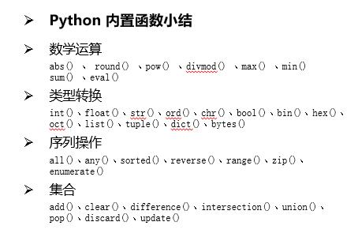

# 前言
1. 什么是函数：
一系列Python语句的组合，可以在程序中运行一次或者多次， 一般是完成具体的独立的功能  

2. 为什么要使用函数：  
代码的复用最大化以及最小化冗余代码，整体代码结构清晰，问题局部化  

3. 函数定义：  
def 函数名():  
	函数体[一系列的python语句，表示独立的功能] 
	 
4. 函数的调用：  
  本质上就是去执行函数定义里面的代码块，在调用函数之前 必须先定义  
  
# 一、函数基础

## 1. 函数参数
1. 必选参数
2. 默认参数【缺省参数】
3. 可变参数  当参数的个数不确定时使用，比较灵活 , 可变参数 传入到 方法内 为 元组类型
定义： def getComputer(*args)
4. 关键字可变参数  关键字参数是一个 字典类型， key是一个字符串  
def keyFunc(**kwargs):

注意： 可选参数 必须放到 关键字可选参数  之前

## 2. 函数返回值
概念：函数执行完以后会返回一个对象，如果在函数的内部有return 就可以返回实际的值,否则返回None
类型：可以返回任意类型，返回值类型应该取决于return后面的类型
用途：给调用方返回数据
在一个函数体内可以出现多个return值：但是肯定只能返回一个return
如果在一个函数体内 执行了return,意味着函数就执行完成退出了，return后面的代码语句将不会执行

## 3. 函数嵌套
函数的分类：根据函数的返回值和函数的参数
1. 有参数无返回值的
2. 有参数又返回值的
3. 无参数又返回值的
4. 无参数无返回值的

# 二、homework 作业
1. 作业一、写函数，接收n个数字，求这些参数数字的和
2. 作业二、写函数，找出传入的 列表或元组 的  奇数位对应的元素  ，并返回一个新的列表
3. 作业三、写函数，检查传入字典的每一个value的长度,如果大于2，那么仅保留前两个长度的内容，并将新内容返回给调用者。

# 三、变量
变量分为 局部变量 和 全局变量 

注意 global 关键字 的使用时机。

## 1.局部变量
1. 局部变量 就是在函数内部定义的变量【作用域仅仅局限在函数的内部】
2. 函数内部的变量名如果第一次出现，且出现在‘=’前面，即被视为该函数定义了一个局部变量，不管全局域中有没有用到该变量名，函数中使用的将是局部变量。
3. 不同的函数 可以定义相同的局部变量，但是各自用各自的 不会产生影响
4. 局部变量的作用：为了临时的保存数据 需要在函数中定义来进行存储

## 2. 全局变量
特点：
1. 全局变量：如果一个变量可以在函数内部调用，也可以在函数外部调用。
2. 全局变量能在函数内部访问，也可以在外部访问，但函数内部不能修改全局变量。
3. 全局变量与局部变量重复,局部变量不会影响全局变量，函数使用局部变量。

总结：
1. 注意：当全局变量和局部变量出现重复定义的时候，程序会优先执行使用函数内部定义的变量【地头蛇】  
2. 如果在函数的内部要想对全局变量进行修改的话 对于不可变类型【str、元组、num】  必须使用 global 关键字进行声明
3. 可变类型的全局变量，可以不用global声明。

# 四、引用
在python中，值是靠引用来传递来的，可以用id()查看一个对象的引用是否相同，id是值保存在内存中那块内存地址的标识。

ch07_引用.py

# 五、匿名函数 lambda表达式

## 1. lambda 表达式
1. python中使用 lambda 关键字创建匿名函数，所谓匿名即这个函数没有名字不用def关键字创建标准的函数。
2. 语法：   lambda 参数1,参数2,参数3: 执行代码语句

使用 lambda表达式 计算两个数和：  
test = lambda x,y:x +y   
test(1,3)  
test(4,5)  
换成普通函数其实就是这样的  
def test(x,y):  
    return x + y  
    
## 2. python的 三元运算 
b if a else c   解释： 如果a表示式为 true 则 为b, 如果为 false 则为 false。

这样的表达式（三元运算）能够放在lambda中，它们能够在lambda函数中来实现选择逻辑：  
greater = (lambda x, y: x if x > y else y)   
greater(3, 5)  
greater(6, 2)  

ch08_匿名函数.py

# 六、递归函数
递归函数 如果一个函数在内部不调用其它的函数，而是自己本身的话，这个函数就是递归函数。
ch09_递归函数.py  主要看例子吧 

# 七、内置函数
`任何一门编程语言的核心操作都是操作内存中的数据，但内存中的数据又是通过编程语言的API来实现，`
所谓的API，就是系统提供给我们的函数，有一种函数是系统预先定义的函数，也就是我们安装python就自带的函数，这种我们把它称为内置函数，也叫内嵌函数

如同人一生下来就有手有脚，会吃会喝一样，具备基本的能力 ，随着成长和学习，我们学会了说话、学会了工作，学会了技能等，而这些能力就如同我们 Python 的扩展函数或扩展库

Python内置函数 python内置了一系列的常用函数，以便于我们使用。所有内置函数官网文档 https://docs.python.org/3/library/functions.html 内置函数

## 0. 函数总结
内置函数功能列表  
Python内置函数 python内置了一系列的常用函数，以便于我们使用。所有内置函数官网文档 https://docs.python.org/3/library/functions.html 内置函数

 

## 1. 数学运算
1. abs()   
描述: abs() 函数返回数字的绝对值
语法: abs( x )
参数: x -- 数值表达式
返回值: 函数返回x（数字）的绝对值

2. round()  
描述: round() 方法对  `浮点数进行近似取值，保留几位小数`
语法: round( x [, n]  )  
参数:   
x -- 数值表达式  
n -- 数值表达式  
返回值: 返回浮点数x的近似值  
`注意`：这里不完全是按照四舍五入或者四舍六入五成双来进行取值的，取值和python的版本有关，还和浮点数的精度有关

3. pow()   
描述: pow()方法返回 𝑥^𝑦（x的y次方） 的值  类似于 ** 算法
语法: pow(x, y[, z])  
参数:   
x -- 数值表达式  
y -- 数值表达式  
z -- 数值表达式  
返回值:返回 xy（x的y次方） 的值  

4. divmod()   
语法: divmod(a, b)  
参数:   
a: 数字  
b: 数字  
返回值: 一个包含商和余数的元组(a // b, a % b)

5. max()   
描述: max() 方法返回给定参数的最大值，参数可以为序列
语法: max( x, y, z, .... )  
参数:   
x -- 数值表达式  
y -- 数值表达式  
z -- 数值表达式  
返回值:返回给定参数的最大值  

6. min()   
描述: min() 方法返回给定参数的最小值，参数可以为序列
语法: min( x, y, z, .... )  
参数:   
x -- 数值表达式  
y -- 数值表达式  
z -- 数值表达式  
返回值: 返回给定参数的最小值  

7. sum()    
描述: sum() 方法对系列进行求和计算  
语法: sum(iterable[, start])  
参数:   
iterable -- 可迭代对象，如：列表、 元组、集合。  是将这个可迭代的对象 进行相加完，然后再与 start相加  
start -- 指定 `相加的参数`，如果没有设置这个值，默认为0  
返回值: 返回计算结果  

8. **eval()**
描述: eval() 函数用来执行一个字符串表达式，并返回表达式的值  
语法: eval(expression[, globals[, locals]])  
参数:   
expression -- 表达式  
globals -- 变量作用域，全局命名空间，如果被提供，则必须是一个字典对象  
locals -- 变量作用域，局部命名空间，如果被提供，可以是任何映射对象  
返回值: 返回表达式计算结果  

## 2. 类型转换
1. int()  
描述: int() 函数用于将一个字符串或数字转换为整型  
语法: class int(x, base=10)  
参数:   
x -- 字符串或数字  
base -- 进制数，默认十进制  
返回值: 返回整型数据  

2. float()  
描述: float() 函数用于将整数和字符串转换成浮点数  
语法: class float([x])  
参数: x -- 整数或字符串  
返回值:返回浮点数

3. str()  
描述: str() 函数将对象转化为适于人阅读的形式  
语法: class str(object='')  
参数: object -- 对象  
返回值:返回一个对象的string格式  

4. ord()   
描述: ord() 函数是 chr() 函数（对于8位的ASCII字符串）或 unichr() 函数（对于Unicode对象）的配对函数，它以一个字符（长度为1的字符串）作为参数，返回对应的 ASCII 数值，或者 Unicode 数值，如果所给的 Unicode 字符超出了你的 Python 定义范围，则会引发一个 TypeError 的异常
语法: ord(c)  
参数: c -- 字符  
返回值:返回值是对应的十进制整数  
 
5. chr()    
描述: chr() 用一个范围在 range（256）内的（就是0～255）整数作参数，返回一个对应的字符
语法: chr(i)  
参数: i -- 可以是10进制也可以是16进制的形式的数字  
返回值:返回值是当前整数对应的ascii字符  

6. bool()  
描述: bool() 函数用于将给定参数转换为布尔类型，如果没有参数，返回 False   
语法: class bool([x])  
参数: x -- 要进行转换的参数  
返回值:返回 Ture 或 False  
下列对象都相当于False：[],(),{},0, None, 0.0, ''  

7. bin()  
描述: bin() 返回一个整数 int 或者长整数 long int 的二进制表示  
语法: bin(x)   
参数: x -- int 或者 long int 数字  
返回值:字符串  

8. hex()  
描述: hex() 函数用于将10进制整数转换成16进制，以字符串形式表示  
语法: hex(x)  
参数: x -- 10进制整数  
返回值:返回16进制数，以字符串形式表示  

9. oct()  
描述: oct() 函数将一个整数转换成8进制字符串  
语法: oct(x)  
参数: x -- 整数  
返回值:返回8进制字符串  

10. list()  
描述: list() 方法用于将元组转换为列表  
语法: list( tup )  
参数: tup -- 要转换为列表的元组  
返回值:返回列表  

11. tuple()  
描述: tuple()函数将列表转换为元组  
语法: tuple(seq)  
参数: seq -- 要转换为元组的序列  
返回值: 返回元组  

12. dict()  
描述: dict() 函数用于创建一个字典  
语法:   
class dict(**kwarg)  
class dict(mapping, **kwarg)  
class dict(iterable, **kwarg)  
参数:   
**kwargs -- 关键字  
mapping -- 元素的容器  
iterable -- 可迭代对象  
返回值: 返回一个字典  

13. bytes()  
描述: bytes()方法返回一个 `新字节数组`，这个数组里的元素是可变的，并且每个元素的值范围: 0 <= x < 256
语法: class bytearray([source[, encoding[, errors]]])  
参数:   
source 为整数，则返回一个长度为 source 的初始化数组；  
source 为字符串，则按照指定的 encoding 将字符串转换为字节序列；  
source 为可迭代类型，则元素必须为[0 ,255] 中的整数；  
source 为与 buffer 接口一致的对象，则此对象也可以被用于初始化 bytes  
如果没有输入任何参数，默认就是初始化数组为0个元素  
返回值:返回新字节数组  

## 3. 序列转换
1. all()    
对应逻辑运算符的 and
all() 函数用于判断给定的可迭代参数 iterable 中的所有元素是否都为 TRUE，如果是返回 True，否则返回 False元素除了是 0、空、FALSE 外都算 TRUE
语法: all(iterable)  
参数: iterable -- 元组或列表  
返回值:如果iterable的所有元素不为0、''、False或者iterable为空，all(iterable)返回True，否则返回False；

2. any()    
对应逻辑运算符的 or
any() 函数用于判断给定的可迭代参数 iterable 是否全部为 False，则返回 False，如果有一个为 True，则返回 True
元素除了是 0、空、FALSE 外都算 TRUE  
语法: any(iterable)  
参数: iterable -- 元组或列表  
返回值:如果都为空、0、false，则返回false，如果不都为空、0、false，则返回true

3. sorted()  
sort 与 sorted 区别：  
sort是应用在 list 上的方法，sorted 可以对所有可迭代的对象进行排序操作,  
list 的 sort 方法返回的是对已经存在的列表进行操作，而内建函数 sorted 方法返回的是一个新的 list，而不是在原来的基础上进行的操作
语法: sorted(iterable[, cmp[, key[, reverse]]])  
参数:   
iterable -- 可迭代对象  
cmp -- 比较的函数，这个具有两个参数，参数的值都是从可迭代对象中取出，此函数必须遵守的规则为，大于则返回1，小于则返回-1，等于则返回0  
key -- 主要是用来进行比较的元素，只有一个参数，具体的函数的参数就是取自于可迭代对象中，指定可迭代对象中的一个元素来进行排序  
reverse -- 排序规则，reverse = True 降序 ， reverse = False 升序（默认）  
返回值:返回重新排序的列表  

4. reverse()  
语法: list.reverse()  
返回值:该方法没有返回值，但是会对 列表 的元素进行反向排序  

5. range()  
语法: range(start, stop[, step])  
参数:   
start: 计数从 start 开始默认是从 0 开始例如range（5）等价于range（0， 5）;  
stop: 计数到 stop 结束，但不包括 stop例如：range（0， 5） 是[0, 1, 2, 3, 4]没有5  
step：步长，默认为1例如：range（0， 5） 等价于 range(0, 5, 1)  

6. zip()  
zip() 函数用于将可迭代的对象作为参数，将对象中对应的元素打包成一个个元组，然后返回由这些元组组成的列表
如果各个迭代器的元素个数不一致，则返回列表长度与最短的对象相同，利用 * 号操作符，可以将元组解压为列表
语法: zip([iterable, ...])  
参数: iterabl -- 一个或多个迭代器;  
返回值:返回元组列表  

7. enumerate()
enumerate()函数用于`将一个可遍历的数据对象(如列表、元组或字符串)组合为一个索引序列，同时列出数据和数据下标，一般用在 for 循环当中`
语法: enumerate(sequence, [start=0])  
参数:   
sequence -- 一个序列、迭代器或其他支持迭代对象  
start -- 下标起始位置  
返回值:返回 enumerate(枚举) 对象  

## 4. 集合
set（集合） 也是python中的一种数据类型，是一个 `无序且不重复` 的元素集合。  

创建集合方式?  
1. 第一种方式:  
set1 = {"1","2"}  # 空{} 就是 dict字典（字典是键值对）, 集合有点类似于 列表，但是列表可以无序且重复
2. 第二种方式:
list1 = ['1','5','4','3']
set2 = set(list1)

1. add()  
add()添加一个元素  

2. clear()  
clear()清空集合的元素

3. difference()  
difference() 两个集合的差集，a中存在，b中不存在

4. intersection()  
intersection()两个集合的交集，a中存在，b中也存在的

5. union()  
union 并集 包含a中的元素，也包含b中的元素

6. pop()  
pop 集合pop随机移除某个元素并且获取那个参数,集合pop没有参数

7. discard()  
discard 移除指定元素

8. update() update 更新集合

## 5. 三元运算 
ch12_内置函数_3三元运算.py ： 很简单  直接看代码

# 八、homework 作业
ch13_homework.py