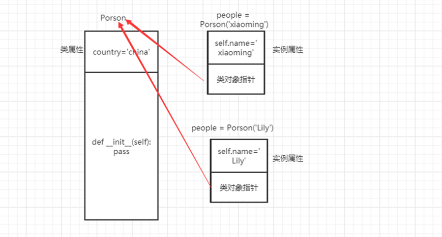

# 一、析构函数
当一个对象被删除或者被销毁时，python解释器也会默认调用一个方法，这个方法为__del__()方法，也称为析构方法

析构方法总结
1、当整个程序脚本执行完毕后会自动调用__del__方法
2、当对像被手动销毁时也会自动调用 __del__ 方法
3、析构函数一般用于资源回收，利用__del__方法销毁对象回收内存等资源

也可以 使用 del 关键字  调用 析构函数   
语法： del 实例对象

# 二、对象三大特征
在python中展现面向对象的三大特征:
封装、继承、多态

## 1. 封装
封装:指的是把内容封装到某个地方，便于后面的使用
他需要:
把内容封装到某个地方
从另外一个地方去调用被封装的内容
对于封装来说 其实就是使用初始化构造方法将内容封装到对象中，然后通过对象直接或者self来获取被封装的内容

## 2. 继承
继承: 和现实生活当中的继承是一样的：也就是 子可以继承父的内容【属性和行为】（爸爸有的儿子都有，相反 儿子有的爸爸不一定有）
 所以对于面向对象的继承来说  其实就是将多个类共有的方法提取到父类中 子类仅需继承父类而不必一一去实现
 这样就可以极大的提高效率 减少代码的重复编写，精简代码的层级结构 便于拓展

 class 类名(父类):
      '''
       子类就可以继承父类中公共的属性和方法
      '''
 	pass
 	
## 3. 多继承的问题
python 有多继承，  java 语法 只有单继承，可以多实现接口  
多继承存在的问题：当继承的类中，有共同的方法时，执行哪一个呢：  

具体看 ch03_多继承.py  ch04_间接继承.py 

python 自带的 __mro__ 方法解析顺序  
如：print（A.__mro__）  
功能：查询执行顺序  
描述：方法的执行顺序可以用mro查看。前面代码查找顺序为 C->A->Base->B>Base1, 一旦找到，则寻找过程立即中断，便不会再继续找了

## 4. 重写父类方法
所谓重写，就是子类中，有一个和父类相同名字的方法，在子类中的方法会覆盖掉父类中同名的方法   

## 5. 调用父类方法
如果在子类中有一个方法需要父类的功能，并且又要添加新的功能。如果直接重写父类方法，那么就要重复写很多代码。那么这就要调用父类方法

1. 方式一 Dog.__init__(self,name,color) #手动调用
2. super().__init__(name, color)  # super是自动找到父类 进而调用方法

ch05_重写和调用父类方法.py 看此案例

## 6. 多态
所谓多态：定义时的 类型和运行时的类型 不一样，此时就成为多态。  

Pyhon不支持Java和C#这一类强类型语言中多态的写法，但是原生多态，Python崇尚“鸭子类型”，利用python伪代码实现Java和C#的多态

多态：顾名思义就是多种状态、形态，就是同一种行为 对于不同的子类【对象】有不同的行为表现

要想实现多态 必须的有 `两个前提` 需要遵守：  
1、继承：多态必须发生在父类和子类之间  
2、重写: 子类重写父类的方法  

多态有什么用:  
增加程序的灵活性  
增加程序的拓展性  

# 三、类属性和实例属性

1. 类属性：就是类对象所拥有的属性，它被所有类对象的实例对象所共有，类对象和实例对象 都可以访问
2. 实例属性：实例对象所拥有的属性，  只能通过  实例对象访问  

类对象 可以调用 类属性和实例属性，实例属性只能通过 类对象 调用  

类属性和实例属性的访问原理  

类属性类对象可以访问，实例对象也可以访问，这与内存中保存的方式有关  

上图中可以看出，所有实例对象的类对象指针指向同一类对象。实例属性在每个实例中独有一份，而类属性是所有实例对象共有一份

# 四、类方法和静态方法

## 1. 类方法
类对象所拥有的方法，需要用装饰器 @classmethod 来标识其为类方法，对于类方法，第一个参数必须是类对象，一般以cls作为第一个参数，类方法可以通过类对象，实例对象调用
类方法主要可以对类属性进行访问、修改

## 2. 静态方法
类对象所拥有的方法，需要用 @staticmethod 来表示静态方法

为什么要使用静态方法呢
1. 由于静态方法主要来存放逻辑性的代码，本身和类以及实例对象没有交互，
2. 也就是说，在静态方法中，不会涉及到类中方法和属性的操作
3. 数据资源能够得到有效的充分利用

## 3. 类方法、实例方法、静态方法对比
1. 类方法的第一个参数是类对象cls，通过cls引用的类对象的属性和方法
2. 实例方法的第一个参数是实例对象self，通过self引用的可能是类属性、也有可能是实例属性(这个需要具体分析)，`不过在存在相同名称的类属性和实例属性的情况下，实例属性优先级更高。`
3. 静态方法中不需要额外定义参数，因此在静态方法中引用类属性的话，必须通过类对象来引用。

## 3. 静态方法

