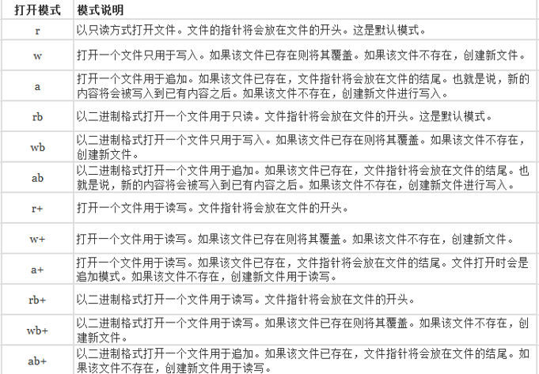
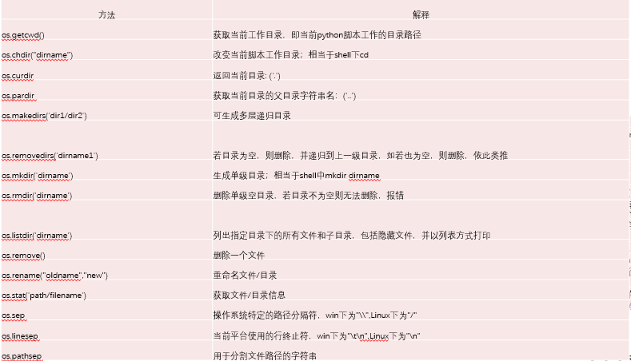
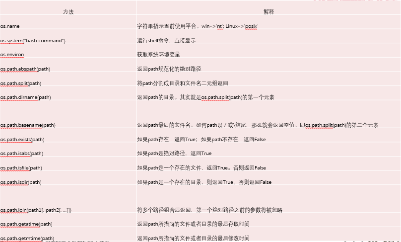

# 一、文件的操作
## 1. 文件操作一般步骤  
1、打开文件 2、读写文件 3、保存文件 4、关闭文件

## 2. 打开文件
语法格式：  
open('文件名称','打开模式’)

## 3. 文件打开模式


## 4. 关闭文件
close() 方法关闭文件
```python
f = open('text.txt','w’) 
f.close() 
```
注意： 打开一个文件之后，一定要关闭，否则后面无法继续操作这个文件。
## 5. with 上下文管理
with 语句，不管在处理文件过程中是否发生异常，都能保证 with 语句执行完毕后已经关闭打开的文件句柄。

示例：
```python
def main(): 
    with open('setup.py','w') as f: 
    content = f.read() 
    print(content) 
    pass

main() 
```
## 6. 写文件
写入文件 write() 方法，参数就是需要写入的内容。
```python
# 写模式打开一个test.txt 文件 
f = open('test.txt', 'w’) 
f.write('我爱中国') # write方法写入内容 
f.close() # 关闭文件 
```

writelines() 可传一个可迭代对象
```python
# 写模式打开一个test.txt 文件 
f = open('test.txt', 'w’) 
# writelines 方法将可迭代对象，迭代写入文件
f.writelines(['我','爱','我的','国家']) 
f.close() # 关闭文件 
```
## 7. 读文件
1. 读取文件 read() ,将文件的内容全部读取出来。
```python
# 写模式打开一个test.txt 文件 
f = open('test.txt', 'r’) 
f.read() # 一次性将文件内容全部取出 
f.close() # 关闭文件 
```
2. 读取指定字符个数 read(num)传入一个数字做参数，表示读取指定字符个数。
```python
# 写模式打开一个test.txt 文件 
f = open('test.txt', 'r’) 
content = f.read(2) # 读取两个字符 
print(content) 
content = f.read() 
print(content) # 第二次读取将从第一次读取的位置继续读取 
f.close() # 关闭文件 
```

3. readlines() 按行读取，一次性读取所有内容，返回一个列表，每一行内容作为一个元素。
```python
# 写模式打开一个test.txt 文件 
f = open('test.txt', 'w’) 
# 写入多行hello world 
f.write('hello world\nhello world\nhello world\nhello world\nhello world\nhello world\n’) 
f.close() 

#打开文件test.txt 
f = open('test.txt', 'r’) 
content = f.readlines() # 一次性读取所有内容，返回一个列表，列表元素为每一行内容 
print(content) 
f.close() # 关闭文件 
```

4. readline() 按行读取，但是一次只读取一行。
```python
# 写模式打开一个test.txt 文件 
f = open('test.txt', 'w’) 
# 写入多行hello world 
f.write('hello world\nhello world\nhello world\nhello world\nhello world\nhello world\n’) 
f.close() 

#打开文件test.txt 
f = open('test.txt', 'r’) 
content = f.readline() # 按行读取，一次读取一行 
print(content) 
f.close() # 关闭文件 
```

# 二、文件的应用:文件备份脚本
## 1. 需求一：
利用脚本完成自动备份，要求用户输入文件名称，完成自动备份
```python
def copyfile(): 
    # 接收用户输入的文件名 
    old_file = input('请输入要备份的文件名：’) 
    file_list = old_file.split(".") 
    # 构造新的文件名，加上备份后缀 
    new_file = file_list[0] + '_备份.' + file_list[1] 
    old_f = open(old_file, 'r’)  # 打开需要备份的文件 
    new_f = open(new_file, 'w’)  # 以写的模式打开新文件,不存在则创建 
    content = old_f.read() # 将文件内容读取出来 
    new_f.write(content) # 将读取的内容写入备份文件 
    # 将打开的文件关闭 
    old_f.close() 
    new_f.close() 

copyfile() 

```
## 1. 需求二：
如果处理超大文件，一次将全部内容读取出来显然是不合适的，在需求1的基础上改进下代码，让它备份大文件也不会导致内存被占满。
```python
def copyBigFile():
    # 接收用户输入的文件名
    old_file = input('请输入要备份的文件名:')
    file_list = old_file.split('.')
    # 构造新的文件名.加上备份的后缀
    new_file = file_list[0] + '_备份.' + file_list[1]
    try:
        # 监视啊哟处理的逻辑
        with open(old_file, 'r') as old_f, open(new_file, 'w')as new_f:
            while True:
                content = old_f.read(1024)  # 一次读取1024字符
                new_f.write(content)
                if len(content) < 1024:
                    break
    except  Exception as msg:
        print(msg)
    pass
```

# 三、文件定位
## 1. tell()
文件定位，指的是当前文件指针读取到的位置，光标位置。在读写文件的过程中，如果想知道当前的位置，可以使用tell()来获取
```python
# 以读模式打开test.txt 文件 
f = open('test.txt','r’) 
content = f.read(3) # 读取三个字符 
# 查看当前游标所在位置 
cur =f.tell() 
print(cur) 

content = f.read(3) # 读取三个字符 
# 查看当前游标所在位置 
cur =f.tell() 
print(cur) 
```
## 2. seek()
如果在操作文件的过程，需要定位到其他位置进行操作，用seek()。
seek(offset, from)有2个参数,offset，偏移量单位字节，负数是往回偏移，正数是往前偏移，from位置：0表示文件开头，1表示当前位置，2表示文件末尾

示例
```python
# 以读模式打开test.txt 文件 
f = open('test.txt',’rb’) 
content = f.read(3) # 读取三个字符 
print(content) 
f.seek(-2, 1) # 在当前位置往回偏移两个字节 

content = f.read(3) # 读取三个字符 
print(content) 

f.seek(-5,2) # 定位到文章末尾，往回偏移5个字节
content = f.read(3) # 读取三个字符 
print(content) 

f.seek(5,0) # 定位到文章末尾，往回偏移5个字节 
content = f.read(3) # 读取三个字符 
print(content) 
# 偏移量为负数，是往回偏移，正数是往前偏移 
```

# 四、文件的导入

```
一、from ...import 首次导入发生了3个步骤
1 以模块为准创造一个模块的名称空间
2 执行模块对应的文件了，将执行过程中产生的名字都丢到模块的名称空间
3 在当前执行文件的名称空间中拿到一个名字，该名字直接指向模块中的某一个名字,
意味着可以不用加任何的前缀而直接使用

二、 优缺点：
优点：不用加前缀 代码更加简洁了
缺点: 容易与当前执行文件中名称空间中的名字冲突


三、 import 到首次导入模块的时候 会发生如下3步操作
1 打开模块文件
2 执行模块对应的文件，将执行过程中产生的名字都丢到模块的名称空间
3 在程序中会有一个模块【可以取别名的】的名称指向模块的名称空间去

四、 相同点和不同点
相同
都会执行模块对应的文件 并且呢 都会产生模块课的名称空间
两者在调用功能时呢，都需要转到定义时寻找作用域关系
不同点
import 需要加前缀  from...import 不需要加前缀

当解释器遇到import关键字，如果模块在当前的搜索路径就会被导入。 
查看import导入的搜索路径，导入模块时会优先搜索当前目录下是否有这个名字的模块，所以在模块命名的时候不要与系统中的模块有重名。
（1）、当前目录
（2）、如果当前目录没有，到环境变量中搜索，可以用sys模块中的path变量查看所有路径。  
（3）、如果都找不到，搜索默认路径，linux系统，默认路径一般为/usr/local/lib/python/


from ... import 导入模块的方法
一个模块可能会存在很多函数，如果只想导入其中几个函数，可以使用from xx import xx 方式导入

使用from导入，如果函数名相同，后面导入的会覆盖前面导入的。
把模块中的所有函数一次性全部导入
语法格式：from xxx import * 
示例：
from time import * 


as 给模块取别名
有时候导入的模块名称很长，调用的时候很不方便，这个使用就可以用as给这个模块取别名。

```
可以使用 sys 模块查看和添加路径  
import sys  
sys.path  :查看所有的路径  
sys.path.append('自己写的路径')  

# 五、os模块
## 1. os操作文件




## 2. time、datetime模块
time.sleep(num) ，让程序执行暂停，num单位是秒
```python
import time 
time.sleep(5) # 程序暂停5s
```
time.time() #返回时间戳时间戳


时间格式


时间操作


具体操作直接看代码吧

# 六、module 调用
```python
__name__ :魔术变量  在本文件中  值为 __main__ ,在外面调用为 文件名
__all__: 魔术变量， 作用：指定外面可以调用的方法 如果在一个文件中存在 __all__ 遍历，那么意味着这个变量中的元素会被
            from XXX import 导入， 对于import 方式来讲 无所谓有没有，都可以全部的引用。

```


# 七、module 的创建、发布、安装
（1）、Python文件都可以作为一个模块，模块的名字就是文件的名字。 比如创建一个test.py文件，文件中创建一个add函数。test.py就是一个模块。
（2）、调用test.py模块
（3）、模块测试 一般写完模块之后都会进行测试，下面来看下这个例子 写好模块之后，在模块中写了一段测试的代码。
    在main.py 导入test模块，执行时模块中的测试代码也执行了。
（4）、为了避免这种情况使用到一个__name__的变量。
    在main.py中导入执行
    知道__name__变量的原理之后，就可以很好的处理测试代码了。 将测试的代码放到 if __name__ = '__main__'：
（5）、__all__ 的作用，如果一个文件中有__all__变量，那么也就意味着这个变量中的元素，会被from xxx import * 时导入
    有all变量import方式导入，可以无异常，可以正常使用。
    from test import * 方式导入

平时使用第三方模块是其他开发者发布出来，需要安装后调用。下面我们来学习怎么去发布一个模块。
（1）、将写好的包放到一个jiaoxue/目录下
（2）、在jiaoxue/目录下创建一个文件setup.py文件
    文件里写入下面代码
```python
from distutils.core import setup 
# name 模块名称 
# version 版本号 
# description 描述 
# author 作者 
# py_modules 要发布的内容 
setup(name="my_module", version="1.0", description="my module", 
author="lilei", py_modules=['test1.A', 'test1.B', 'test2.C', 'test2.D']) 

```
（3）、 创建模块
python setup.py build
（4）、生成压缩包
python setup.py sdist
（5）、tree 看下jiaoxue目录下的结构
（1）、将上一节生成的压缩包复制到桌面解压
    直接cmd 模式打开桌面
    使用 pip install -g 压缩包名称


